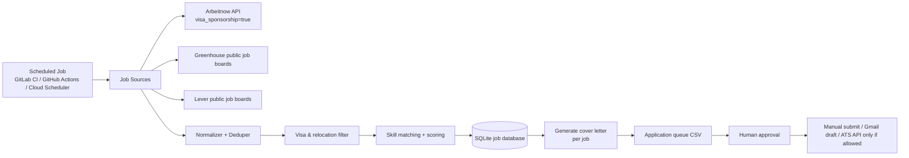
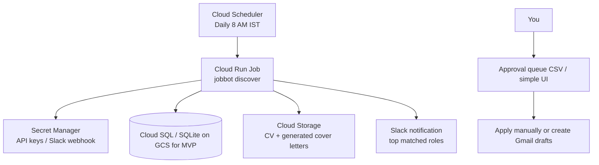

# Europe DevOps Job Automation — Visa Sponsorship MVP

This project helps a DevOps / Cloud Engineer automatically discover Europe-based openings that mention visa sponsorship or relocation support, score them against the candidate profile, generate a tailored cover letter, and prepare an application queue for review.

> Important: this system is intentionally **human-in-the-loop**. It does not blindly submit applications to LinkedIn, Workday, Greenhouse, Lever, or company career sites. Many job sites prohibit automated submissions, and forms often contain legal consent questions. The safe design is: automate discovery, scoring, CV/cover-letter creation, and reminders; approve each application before final submission.

## Candidate profile used

The default config is tuned for Rahul Prajapati, a DevOps / Cloud Engineer with strong experience in GCP, AWS, Azure, Terraform, Kubernetes, Helm, ArgoCD, GitLab CI/CD, Cloud Run, Anthos/Istio, observability, and internal DevOps automation.

Target roles:

- DevOps Engineer
- Cloud Engineer
- Platform Engineer
- Site Reliability Engineer
- Infrastructure Engineer
- Kubernetes Engineer

Target countries:

- Germany
- Netherlands
- Ireland
- United Kingdom
- Sweden
- Spain
- Portugal
- Denmark
- Finland

## What it automates



## Recommended architecture on GCP



For the first version, run it from GitLab CI schedule or GitHub Actions. Move to Cloud Run Job when it is stable.

## Setup

```bash
python3 -m venv .venv
source .venv/bin/activate
pip install -r requirements.txt
pip install -e .
cp config/config.example.yaml config/config.yaml
cp .env.example .env
```

Put your CV PDF at:

```bash
data/Rahul_Prajapati.pdf
```

Then run:

```bash
python -m jobbot discover --config config/config.yaml
python -m jobbot package --config config/config.yaml --min-score 70
```

Outputs:

```text
data/jobs.sqlite
out/application_queue.csv
out/applications/<company>-<role>/cover_letter.md
out/applications/<company>-<role>/metadata.json
```

## How scoring works

A role gets a score out of 100:

- +25 for role/title match: DevOps, Cloud, Platform, SRE, Infrastructure, Kubernetes
- +30 for skill match: GCP, Kubernetes, Terraform, Helm, ArgoCD, GitLab CI, Cloud Run, Istio, observability, Prometheus, Grafana, Signoz, Teleport, Python, Go
- +25 for visa/relocation signal: visa sponsorship, relocation assistance, Blue Card, work permit sponsorship
- +10 for Europe target location match
- +10 for seniority fit
- hard reject if text says: no visa sponsorship, must already have work authorization, EU citizenship required, sponsorship unavailable

## Automation modes

### 1. Safe default: `draft_only`

Creates cover letters and an application queue. You review and submit manually.

### 2. Gmail draft mode: `gmail_draft`

Creates Gmail drafts only for companies where a hiring/recruiting email is explicitly present in the job post. It does not send automatically.

### 3. ATS API mode: `ats_api_approved`

Only use this when:

- the ATS officially supports application submission via API,
- you have valid credentials/API keys,
- the target company/job permits API submission,
- the job is marked approved in `application_queue.csv`.

## GitLab scheduled pipeline

Create a GitLab CI/CD schedule for daily discovery:

```yaml
stages:
  - discover

job_search:
  image: python:3.12-slim
  stage: discover
  before_script:
    - pip install -r requirements.txt
  script:
    - python -m jobbot discover --config config/config.yaml
    - python -m jobbot package --config config/config.yaml --min-score 70
  artifacts:
    when: always
    paths:
      - out/
      - data/jobs.sqlite
```

## Best daily workflow

1. Run the scheduled discovery every morning.
2. Review `out/application_queue.csv`.
3. For every good role, open the apply URL.
4. Use the generated cover letter.
5. Track status in the CSV: `new`, `approved`, `applied`, `rejected`, `interview`, `offer`.

## Notes for Europe visa sponsorship

For Germany, keep salary thresholds in mind because EU Blue Card eligibility depends on job offer, contract duration, matching qualification, and salary threshold. For the Netherlands, the employer is the sponsor and IT professionals may use education or qualifying experience routes depending on the permit.

