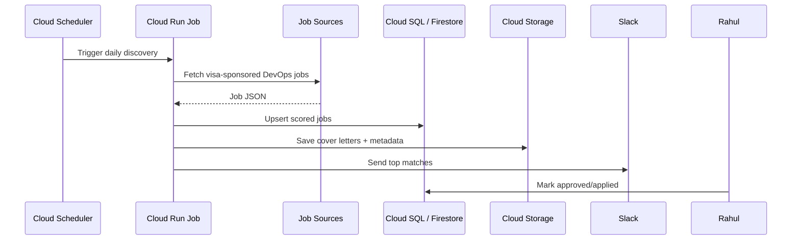

# Optional GCP deployment design

Use this after the MVP is stable locally or in GitLab CI.

## Components

- Cloud Scheduler: triggers daily job search.
- Cloud Run Job: runs `python -m jobbot discover` and `python -m jobbot package`.
- Secret Manager: stores Slack webhook, optional Gmail credentials, and ATS keys.
- Cloud Storage: stores generated cover letters and CV packages.
- Cloud SQL or Firestore: stores job records and application status.

## Flow

